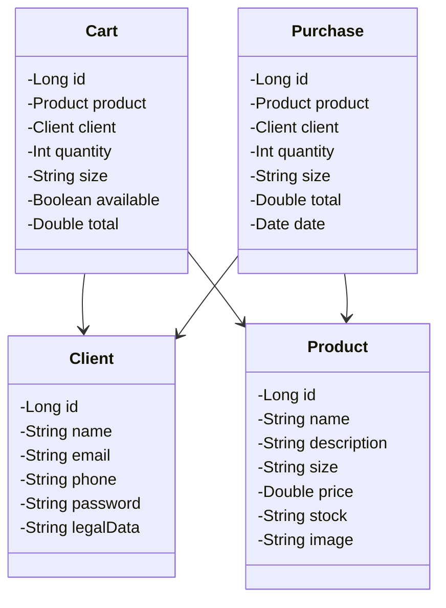

  

<h1 align="center"> Savio Store </h1>

<h1 align="center"> Links </h1>

Site feito para a materia Programação Orientada a Objetos do curso Ciencias da Computação da UFG (Universidade Federal de Goiás)   

  <a href="#-tecnologias">Tecnologias</a>&nbsp;&nbsp;&nbsp;|&nbsp;&nbsp;&nbsp;
  <a href="#-projeto">Projeto</a>&nbsp;&nbsp;&nbsp;|&nbsp;&nbsp;&nbsp;
  <a href="#-layout">Layout</a>&nbsp;&nbsp;&nbsp;|&nbsp;&nbsp;&nbsp;
  <a href="#%EF%B8%8F-estrutura-banco-de-dados">Estruturas banco de dados</a>&nbsp;&nbsp;&nbsp;|&nbsp;&nbsp;&nbsp;
  <a href="#-autores">Autores</a>&nbsp;&nbsp;&nbsp;|&nbsp;&nbsp;&nbsp;

## 🚀 Tecnologias

Esse projeto foi desenvolvido com as seguintes tecnologias:

- React e JavaScript
- Java e Spring
- MySql
- JUnit e Mockito
- Git e Github

## 💻 Projeto

A Savio Store é um site destinado a compra de roupas e sapatos da marca Savio Store.

## 🔖 Layout

  <table>
    <tr>
      <td>
        
      </td>
      <td>
        
      </td>
    <tr/>
    <tr>
      <td>
        
      </td>
      <td>
        
      </td>
    </tr>
    <tr>
      <td>
        
      </td>
      <td>
        
      </td>
    </tr>
  </table>

## 🗂️ Estrutura Banco de Dados

## 💻 Autores

- [@Emmanuel](https://github.com/manotv-alt)
- [@Gabriel](https://github.com/GabSoares404)
- [@Luiz](https://github.com/LuizGDC7)
- [@Matheus](https://github.com/gauloish)
- [@Monik](https://github.com/MonikAlves)
